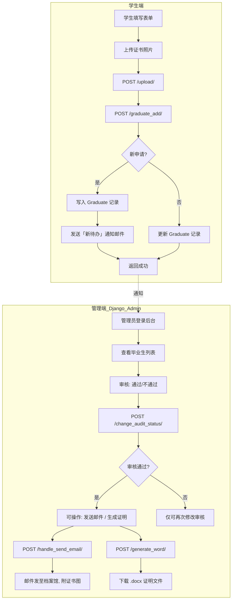
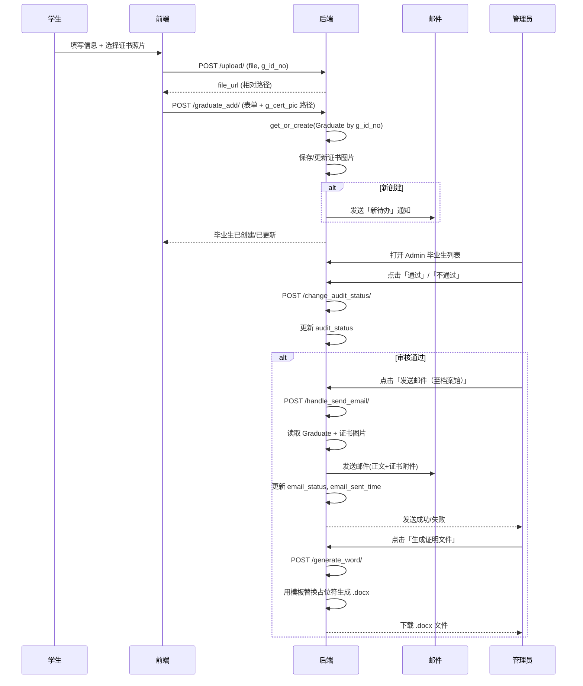
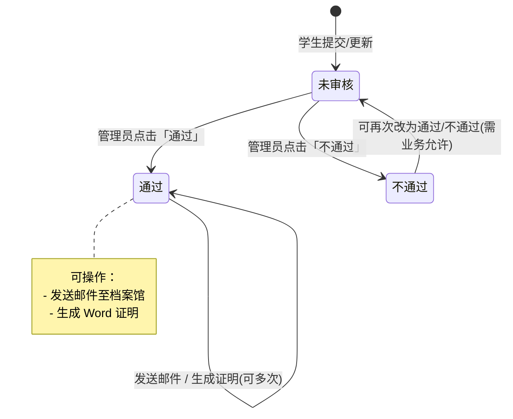

# 毕业生无高校学生登记证明 — 业务逻辑说明

本文档面向新维护者，说明系统业务流程、数据模型与接口关系。

---

## 一、整体业务流程图

---

## 二、核心业务流程（泳道图）

---

## 三、数据模型与状态

### 3.1 核心实体：Graduate（毕业生）

| 字段 | 说明 |
|------|------|
| g_id_no | 身份证号（唯一） |
| g_name, g_sex, g_college, g_major, g_year | 基本信息 |
| g_phone, g_mailing_address, g_email | 联系与邮寄信息 |
| g_cert_pic | 毕业证书照片（上传后存于 media/certificates/） |
| **audit_status** | 审核状态：0 未审核 / 1 通过 / 2 不通过 |
| **email_status** | 邮件状态：0 未发送 / 1 成功 / 2 失败 |
| email_sent_time | 邮件发送时间 |
| created_at | 创建时间 |

### 3.2 状态流转图

---

## 四、API 与页面职责

| 路径 | 方法 | 说明 | 调用方 |
|------|------|------|--------|
| `/` | GET | 重定向到 `/admin/` | 浏览器 |
| `/admin/` | - | Django Admin 毕业生列表与操作 | 管理员 |
| `/graduate_add/` | POST | 创建或更新毕业生；新申请时发「新待办」邮件 | 学生端前端 |
| `/upload/` | POST | 上传证书图片，返回相对路径 | 学生端前端 |
| `/change_audit_status/` | POST | 更新审核状态（通过/不通过） | Admin 页内 JS |
| `/handle_send_email/` | POST | 对该条记录发邮件至档案馆（带证书附件） | Admin 页内 JS |
| `/generate_word/` | POST | 按模板生成 Word 证明并返回下载 | Admin 页内 JS |

---

## 五、邮件逻辑

- **环境区分**：`settings.py` 中根据 `DEBUG` 自动切换  
  - **本地（DEBUG=True）**：QQ 邮箱（smtp.qq.com:587）  
  - **部署（DEBUG=False）**：兰大邮箱（smtp.lzu.edu.cn:25）  
  均可通过环境变量覆盖（如 `EMAIL_SMTP_PASSWORD`）。

- **两类邮件**  
  1. **新待办通知**（`graduate_add` 内）：学生新提交后发给管理员，正文含申请人信息与待办数量。  
  2. **核对双证邮件**（`handle_send_email`）：管理员在后台触发，发给档案馆，正文含学生信息，附件为毕业证书照片。

- **失败处理**：发信失败不会导致 500，会返回明确错误信息（如 `email_error`），毕业生记录照常创建/更新。

---

## 六、文件与配置要点

| 文件/目录 | 作用 |
|-----------|------|
| `collectAndSendEmailAdmin/models.py` | Graduate 模型及常量（审核/邮件状态） |
| `collectAndSendEmailAdmin/views.py` | graduate_add, handle_send_email, change_audit_status, generate_word, upload, send_email |
| `collectAndSendEmailAdmin/admin.py` | 列表展示、筛选、搜索、自定义按钮（审核/发邮件/生成证明） |
| `collectAndSendEmailAdmin/urls.py` | 路由表 |
| `collectAndSendEmailAdmin/settings.py` | 邮件 SMTP 配置（含 DEBUG 分支） |
| `docx/template_1.docx` | Word 证明模板（占位符如 #姓名、#学院 等） |
| `media/certificates/` | 上传的证书图片存储路径 |

---

*文档随代码更新，若有新增接口或状态，请同步修改此说明。*
